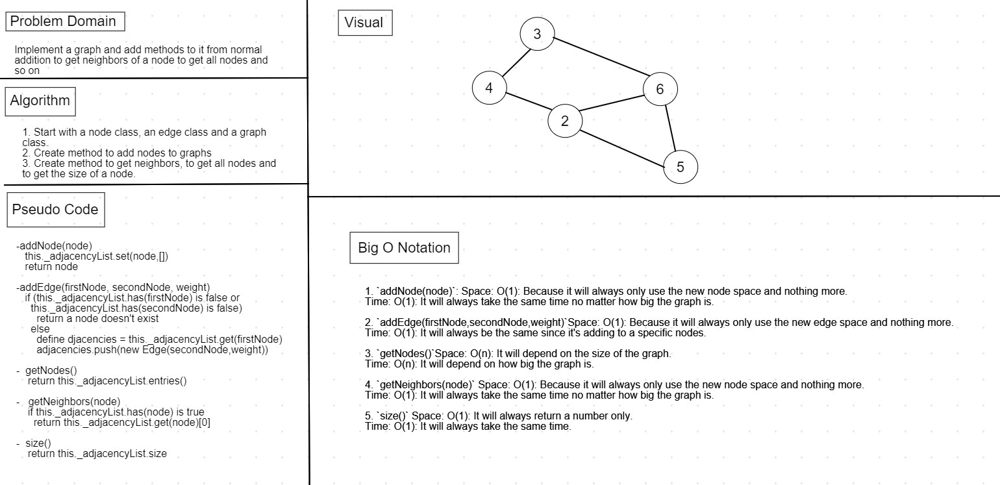

# Graphs

* A graph is a non-linear data structure that can be looked at as a collection of nodes or vertices that may be connected by edges.

## Challenge

* Implement a graph with the following methods:
1. `addNode(node)`
2. `addEdge(firstNode,secondNode,weight)`
3. `getNodes()`
4. `getNeighbors(node)`
5. `size()`

## Approach & Efficiency

1. Start with a node class, an edge class and a graph class.
2. Create method to add nodes to graphs 
3. Create method to get neighbors, to get all nodes and to get the size of a node.

## Big O 

1. `addNode(node)`: Space: O(1): Because it will always only use the new node space and nothing more.
Time: O(1): It will always take the same time no matter how big the graph is.
 
2. `addEdge(firstNode,secondNode,weight)`Space: O(1): Because it will always only use the new edge space and nothing more.
Time: O(1): It will always be the same since it's adding to a specific nodes.

3. `getNodes()`Space: O(n): It will depend on the size of the graph.
Time: O(n): It will depend on how big the graph is.

4. `getNeighbors(node)` Space: O(1): Because it will always only use the new node space and nothing more.
Time: O(1): It will always take the same time no matter how big the graph is.

5. `size()` Space: O(1): It will always return a number only.
Time: O(1): It will always take the same time.

## API
1. `addNode(node)`: takes a node and adds it to the graph.
2. `addEdge(firstNode,secondNode,weight)`: Takes two nodes and an optional weight, then connects the first node with the second node using an edge.
3. `getNodes()`: Lists all available nodes in that graph.
4. `getNeighbors(node)`: Takes in a node and returns it's edges
5. `size()`: Returns the number of existing nodes inside the graph.

## Whiteboard

--------------------------------------------------------------------------------

## Breadth First Graphs

### Challenge

* Create a method that traverses the graph based on breadth-first traversal method that accepts a starting node.

### Approach & Efficiency

1. Create a function that accepts a node.
2. Create a queue and add the starting node to it.
3. Define an empty array to show all visisted arrays and add the first node to it.
4. Use a while loop to traverse through the queue and add edges to it.
5. Get the neighbors of the node.
6. If the new node exists inside the array, ignore it, if not add it to queue.
7. Return the array.

### Big O 

Space: O(n): Because it will create a queue depending on how many edges there is.

Time: O(n2 ): It has nested for loops so it will take n2.

### Whiteboard
