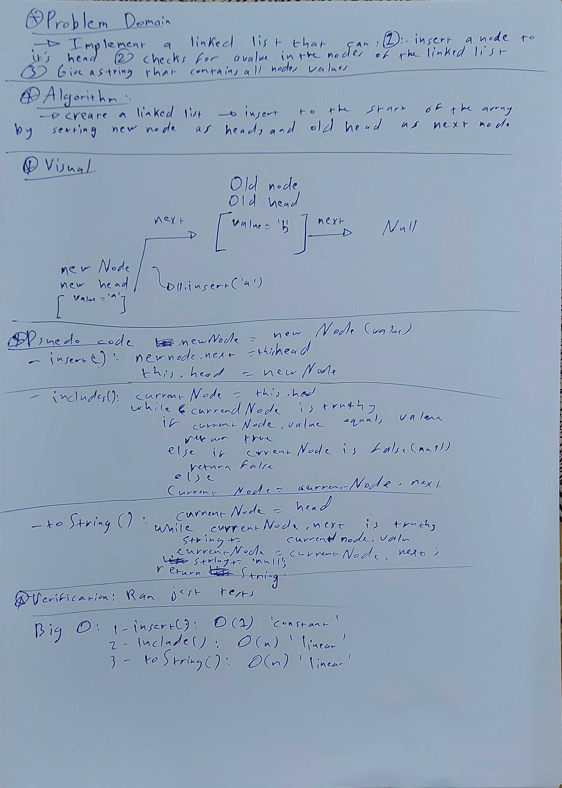
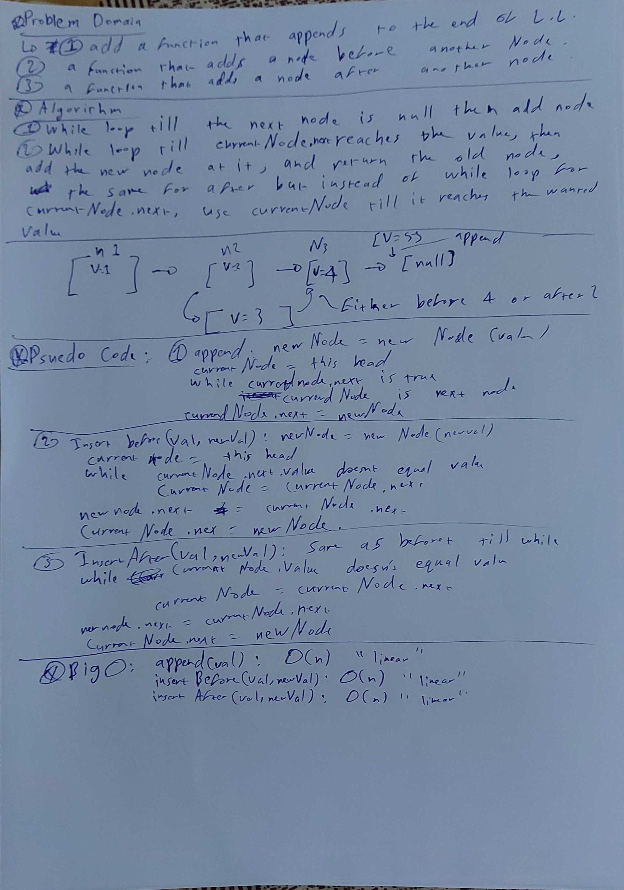
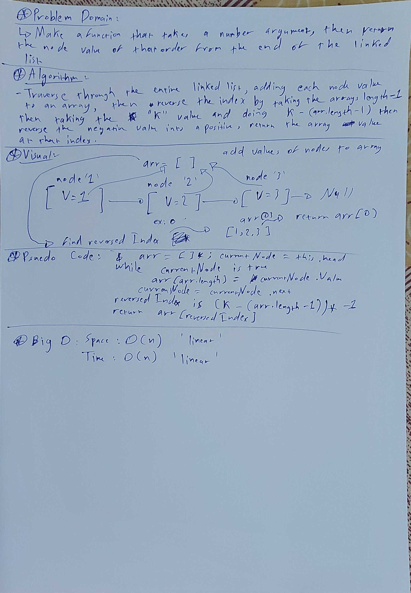

# Linked List

## Code Challenge 5: Singly Linked List

* Singly linked lists are nodes that contain 2 types of information, their value and a pointer to the next node.

* [GitHub Actions](https://github.com/ammarBadwan-401-advanced-javascript/data-structures-and-algorithms/actions)

### Challenge
1- Create and instantiate an empty Linked List

2- Define a method called insert which takes any value as an argument and adds a new node with that value to the head of the list with an O(1) Time performance.

3- Define a method called includes which takes any value as an argument and returns a boolean result depending on whether that value exists as a Node’s value somewhere within the list.

4- Define a method called toString which takes in no arguments and returns a string representing all the values in the Linked List.

### Approach & Efficiency

* Created a module for node class, another module for linked list class and then I added the methods to it, methods that add a node to the linked list, check if a node exists within this linked list and method to see all current nodes.

* Efficiency: Big O Notation

1- `insert(value)` : O(1) "constant"

2- `include(value)` : O(n) "linear"

3- `toString()` : O(n) "linear"

### API

1- `insert(value)`: adds a node with its argument as a value to the beginning of the linked list.

2- `include(value)`: Checks if a value exists in a node in the linked list, if it does it returns true, if not it returns false.

3- `toString()`: Types all the node values inside the linked list as a string with an arrow between them like `{ a } -> { b } -> null`

* Whiteboard: 

---------------------------------------------------------------------------

## Code Challenge 6: Linked List Insertions

* In this code challenge you must do a function that adds to the end of the linked list, a function that inserts a new node before a node that contains a specific value and a function that adds a node after a node that contains a specific value.

### Challenge

1- `.append(value)` which adds a new node with the given value to the end of the list

2- `.insertBefore(value, newVal)` which add a new node with the given newValue immediately before the first value node

3- `.insertAfter(value, newVal)` which add a new node with the given newValue immediately after the first value node

### Approach and efficiency

* To add to the end of the linked list, you must traverse the entirety of the linked list to the end using while loop, then add the new node as the next value.

* To insert before a node, you must traverse to the node that the next value of it is the value you want to add before it, then add the new node in its place and add the old remaining node into the next value of the new node.

* To insert after a node, traverse using while loop same as before except that you need to check for the value of the current node, not the next node, after you reach it you add the new node as the next value, while attaching the remaining values as the next node.

* Efficiency: Big O Notation

1- `append(value)` : O(n) "linear"

2- `insertBefore(value,newVal)` : O(n) "linear"

3- `insertAfter(value,newVal)` : O(n) "linear"

## API

1- `append(value)` : Adds a new node to the end of the linked list.

2- `insertBefore(value,newVal)` : Adds a new node before a node with a specific value.

3- `insertAfter(value,newVal)` : Adds a new node after the node with a specific value.

* Whiteboard: 

---------------------------------------------------------------------------

## Code Challenge 7: k-th value from the end of a linked list.

* In this code challenge we must make a function that takes the k-th value from the end of a linked list and find the value of that node from the entered k-th value

### Challenge

1- `.kthFromEnd(k)` a method for the Linked List class which takes a number, k, as a parameter and returns the node’s value that is k from the end of the linked list.

### Approach and efficiency

* Traverse the linked list with a while loop, adding the value of each node to an outside array.

* Check for exception in the rules of k (if its a negative number, if its not a number etc...) and return an exception if thats the case.

* Reverse the index number so we can take the right value out of the array, we can do that by using this algorithm ` (k - (array.length-1)) * -1`.

* Return the array at the reversed index `arr[reversedIndex]`.

* Efficiency: Big O Notation

* `kthFromEnd(k)`: Space: O(n) "linear" , Time: O(n) "linear".
Because the function only has a while loop with a maximum length of n (depends on how many nodes exists within the linked list) the while loop will iterate a maximum number of n so the Big O Notation is O(n).

## API

* `kthFromEnd(k)` : Finds the value of the node that is numbered k from the end of the linked list.

* Whiteboard: 
