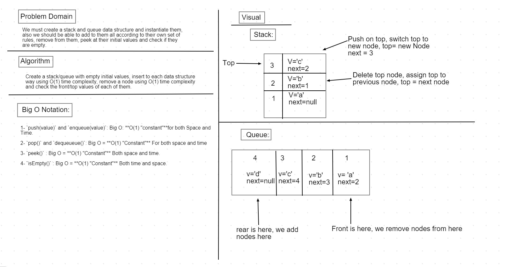

# Stacks and Queues

## Code Challenge 10: Stacks and Queues implementation

* A stack is a data structure that consists of nodes, each node references the next node in the stack but doesn't reference the previous one, it follows first in last out concept.
* A queue has a front and rear, the front gets added first and stay's there and everyone added after is added behind all the previous nodes, it follows first in first out concept.

### Challenge

1- Create an empty Node class.

2- Create and instantiate a Stack and/or a Queue.

3- Define methods that take in a value and adds it to the stack/queue each in their own way (stacks add to the top while queues add to the rear).

3- Define a method that removes a node from the stack/queue (stack removes from the top while queuees removes from the front).

4- Define a method that peaks on the first node value (in stack thats the top node value, while in the queues thats the front node value).

5- Define a method that finds if the queue/stack is empty and returns a boolean.

### Approach & Efficiency

#### In Stack:
* Created a node class, then created stack class that has a top value and that has multiple methods which are:

1- `push(value)`: create a new node,then assign the previous top as its next value, then assign that node as the current top node.

2- `pop()`: changed the top value from the current node to the next node in the stack.

3- `peek()`: returned the top node value.

4- `isEmpty()`: used an if condition with the top value, if its empty returns true and vice versa.

#### In Queue
* Creaed node class, then created queue class that has a front value and multiple methods which are:

1- `enqueue(value)`: Created a new node,then assigned the front node next to the new node and changed the old rear to the new node.

2- `dequeueue()`: changed the current front value to the front's next value which means deleting the first node.

3- `peek()`: retrieves the front node value.

4- `isEmpty()`: checks if the front property got a node and returs a boolean.

### Efficiency: Big O Notation

1- `push(value)` and `enqueue(value)`: Big O: **O(1) "constant"**for both Space and Time:  because it will always add to the top of the queue in stack and to the rear of the queue  in queues, it doesnt matter how many nodes there is.

2- `pop()` and `dequeueue()`: Big O = **O(1) "Constant"** For both space and time, it will always remove from one place, for queues it deletes from the rear and for stack from the top always, it doesnt matter how many nodes there is.

3- `peek()` : Big O = **O(1) "Constant"** Both space and time, it will always return the first node value, whether that is top in stack or front in queue, it doesnt matter how many nodes there is.

4- `isEmpty()` : Big O = **O(1) "Constant"** Both time and space, as it only checks the front/top nodes and if they have a value, it doesnt matter how many nodes there is.

### API

1- `push(value)`: create a new node,then assign the previous top as its next value, then assign that node as the current top node.

2- `pop()`: changed the top value from the current node to the next node in the stack.

3- `peek()`: returned the top node value.

4- `isEmpty()`: used an if condition with the top value, if its empty returns true and vice versa.

5- `enqueue(value)`: Created a new node,then assigned the front node next to the new node and changed the old rear to the new node.

6- `dequeueue()`: changed the current front value to the front's next value which means deleting the first node.

* Whiteboard: 

