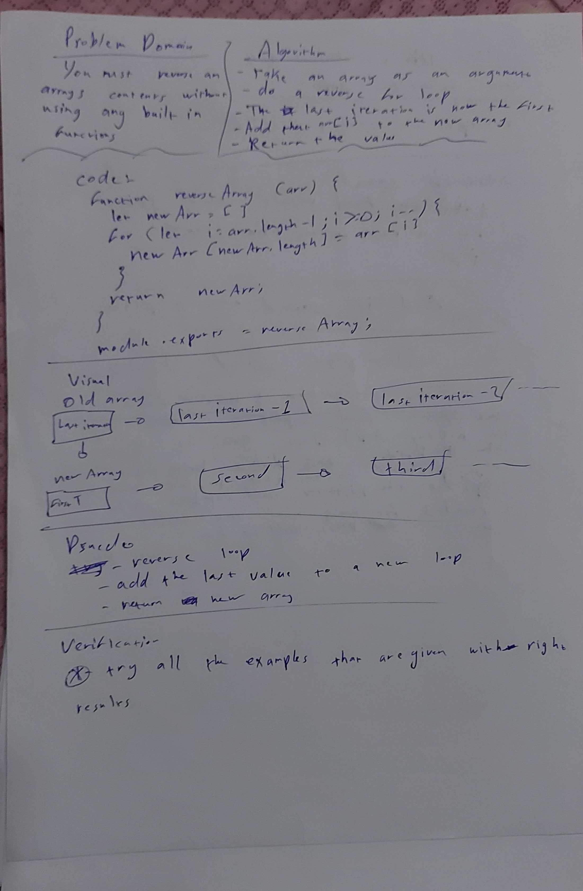

# Reverse an Array

We must take an array and reverse its contents without using the built in functions of Javascript.

## Challenge
Reverse an Array without using built in functions.

## Approach & Efficiency
I made a reverse loop, and i kept adding to the length of the array so i can add new value without using push.

## Solution
