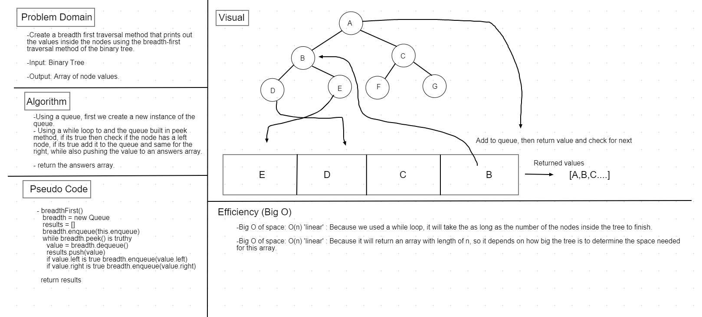

# Code Challenge 17: Breadth First Traversal

* We need to create a breadth first traversal method that prints out the values inside the nodes using the breadth-first traversal method of the binary tree.

## Challenge

* Write a breadth first traversal method which takes a Binary Tree as its unique input, traverse the input tree using a Breadth-first approach, and return a list of the values in the tree in the order they were encountered.

## Approach & Efficiency

* Using a queue, first we create a new instance of the queue.

* Using a while loop to and the queue built in peek method, if its true then check if the node has a left node, if its true add it to the queue and same for the right, while also pushing the value to an answers array.

* Return the answers array.

### Efficiency: Big O:

* Big O of space: O(n) 'linear' : Because we used a while loop, it will take the as long as the number of the nodes inside the tree to finish.

* Big O of space: O(n) 'linear' : Because it will return an array with length of n, so it depends on how big the tree is to determine the space needed for this array.

## API

* `breadthFirst(tree)` takes a tree as it's argument, traverses it using breadth first, then return all the values from the nodes inside the tree.

# Whiteboard
