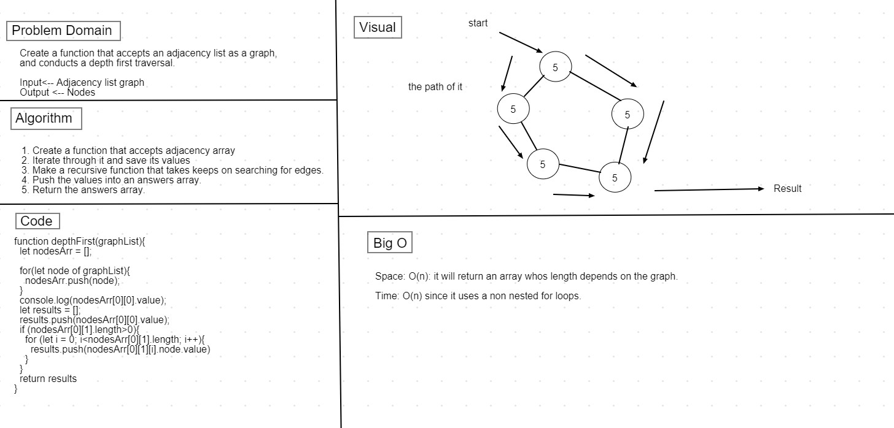

## Depth first

### Challenge

* Create a function that accepts an adjacency list as a graph, and conducts a depth first traversal, that returns a collection of nodes in their pre-order depth-first traversal order.

### Approach & Efficiency

1. Create a function that accepts adjacency array
2. Iterate through it and save its values
3. Make a recursive function that takes keeps on searching for edges.
4. Push the values into an answers array.
5. Return the answers array.

### Big O 

Space: O(): It will return an array whos length depends on the graph.

Time: O(): Since it uses a non nested for loops.

### Whiteboard
