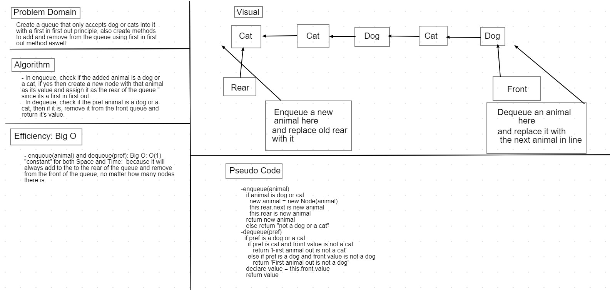

# Code Challenge 12: First-in, First out Animal Shelter.

* Create a queue that only accepts dog or cats into it with a first in first out principle, also create methods to add and remove from the queue using first in first out method aswell.

### Challenge

* 1- Create a class called AnimalShelter which holds only dogs and cats. The shelter operates using a first-in, first-out approach.

* 2- Implement the following methods:

  a)enqueue(animal): adds animal to the shelter. animal can be either a dog or a cat object.

  b) dequeue(pref): returns either a dog or a cat. If pref is not "dog" or "cat" then return null.

### Approach & Efficiency

* 1- In `enqueue(animal)`, check if the added animal is a dog or a cat, if yes then create a new node with that animal as its value and assign it as the rear of the queue since its a first in first out.

* 2- In `dequeue(pref)`, check if the pref animal is a dog or a cat, then if it is, remove it from the front queue and return it's value.

### Efficiency: Big O Notation

* `enqueue(animal)` and `dequeue(pref)`: Big O: O(1) "constant" for both Space and Time:  because it will always add to the to the rear of the queue and remove from the front of the queue, no matter how many nodes there is.

### API

1- `enqueue(animal)`: Created a new node,then assigned the rear node's next to the new node and changed the old rear to the new node.

2- `dequeueue(pref)`: check if the pref animal is a dog or a cat,if yes, then change the current front value to the front's next value which means deleting the first node.

* Whiteboard: 

