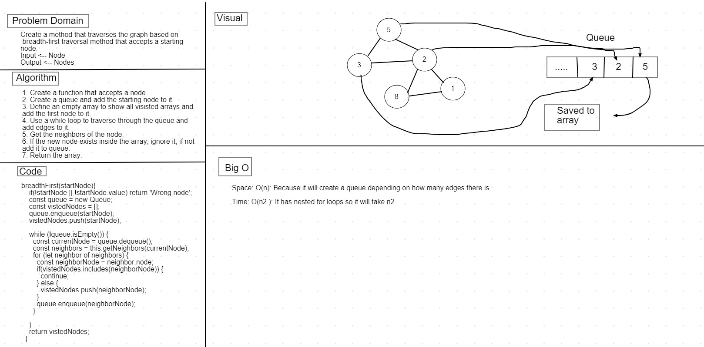

## Get Edge

### Challenge

* Create a function that takes in a graph and an array of city names and returns if a direct connection exists inside them.

### Approach & Efficiency

1. Create a function that accepts a graph and an array.
2. Check if the graph or array are empty, if not continue.
3. Retrieve the nodes inside the graph.
4. Check if the value exists inside the node.
5. if there is a value, assign it to a variable.
6. Iterate through the edges of those nodes to find the value.
7. Return value with price.

### Big O 

Space: O(n2): Because it will use space depending on how big two arrays are

Time: O(n2 ): It has nested for loops so it will take n2.

### Whiteboard
