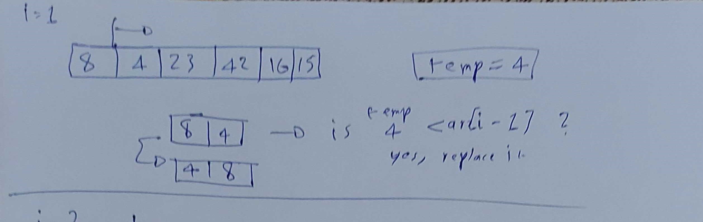
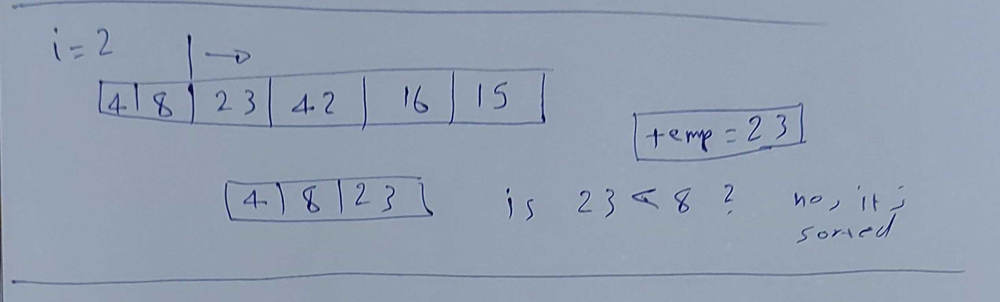
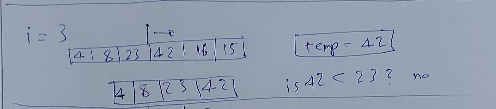
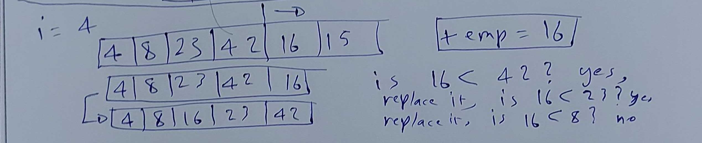
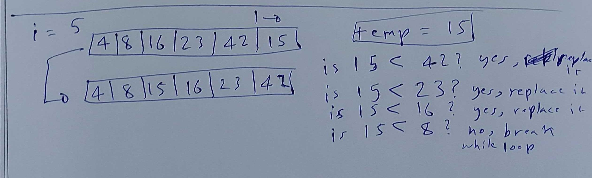

# Insertion Sort

* Insertion sort is a simple sorting algorithm that builds the final sorted array (or list) one item at a time.

```Pseudo code
SelectionSort(int[] arr)
    DECLARE n <-- arr.Length;
    FOR i = 0; i to n - 1  
        DECLARE min <-- i;
        FOR j = i + 1 to n
            if (arr[j] < arr[min])
                min <-- j;

        DECLARE temp <-- arr[min];
        arr[min] <-- arr[i];
        arr[i] <-- temp;
```

* That was the pseudo code provided, here is my implemented javascript version of it

```Javascript
function insertionSort(arr){
  for(let i=1;i<arr.length;i++){
    let j = i-1;
    let temp = arr[i];
    while (j>=0 && temp < arr[j]){
      arr[j+1] = arr[j];
      j = j-1;
    }
    arr[j+1] = temp;
  }
  return arr;
```

## Trace

Sample Array: `[8,4,23,42,16,15]`

### Pass 1




Here we compared the temp value with the first value of the array, it was higher so the while loop got initiated and replaced the higher value with the lower one.


### Pass 2



Here the temp is already bigger than the previous values, so no change is needed.

### Pass 3



Same as before, the temp is bigger so no change is needed.

### Pass 4



Here, 16 is less than 42 so we swap the values, now we check the value before it which is 23, it's also less so we also swap it, after that the value is 8 and we dont swap since temp is higher and the while loop breaks.

### Pass 5



Same as above, temp is 15 which is lower than 42, also lower than 23 and lower than 16 but not 8 so it comes before 16 and after 8.

### Efficiency

* Time: O(n^2) because at it's worse, there will be 2 loops inside eachother which means n*n = n^2.

* Space: O(1) because the array itself is being changed in place so no additional space is created.