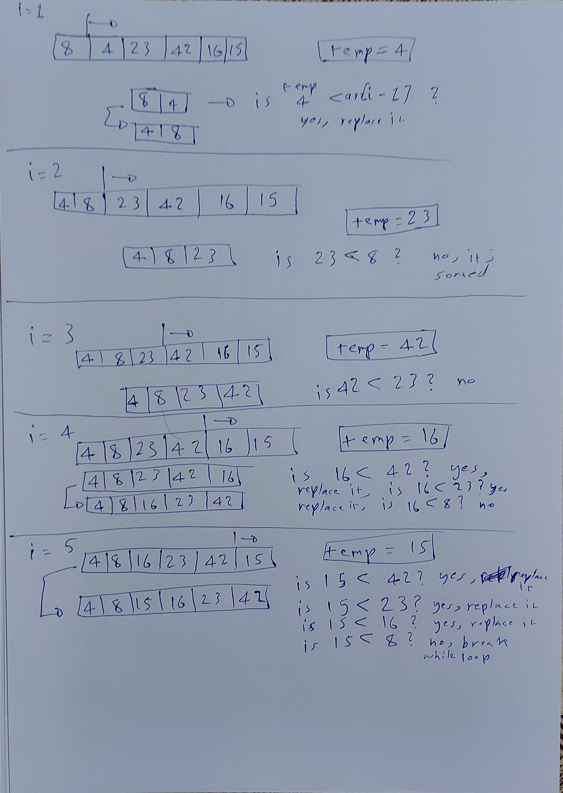

# Code Challenge 26: Insertion Sort

* Insertion sort is a simple sorting algorithm that builds the final sorted array (or list) one item at a time.

## Challenge

Convert the pseudo code to javascript and detail the process of each step in the algorithm and write it in BLOG.md

[Link to the blog](https://github.com/ammarBadwan-401-advanced-javascript/data-structures-and-algorithms/tree/master/challenges/insertionSort/BLOG)

## Approach and Efficiency

* We start at index 1, then save it's value in a variable called temp and compare it with the previously sorted arrays, if the temp is less than the sorted array value we swap it until the while loop reaches iteration 0 or until temp is higher than the sorted value we are currently at, then we do it all over for the entire array until it's done.

### Efficiency

* Time: O(n^2) because at it's worse, there will be 2 loops inside eachother which means n*n = n^2.

* Space: O(1) because the array itself is being changed in place so no additional space is created.

## Visual step through

