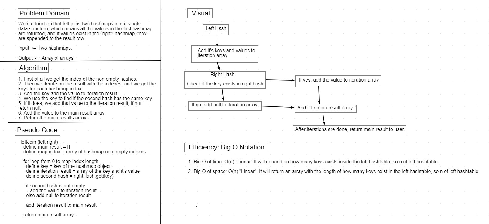

# Code Challenge 33: Left Join.

### Challenge

* Write a function that left joins two hashmaps into a single data structure, which means all the values in the first hashmap are returned, and if values exist in the “right” hashmap, they are appended to the result row. 

### Approach & Efficiency

1. First of all we get the index of the non empty hashes.
2. Then we iterate on the result with the indexes, and we get the keys for each hashmap index.
3. Add the key and the value to iteration result.
4. We use the key to find if the second hash has the same key.
5. If it does, we add that value to the iteration result, if not return null.
6. Add the value to the main result array.
7. Return the main results array.

### Efficiency: Big O Notation

1- Big O of time: O(n) "Linear":It will depend on how many keys exists inside the left hashtable, so n of left hashtable.

2- Big O of space: O(n) "Linear": It will return an array with the length of how many keys exist in the left hashtable, so n of left hashtable.

### API

`leftJoin (leftHash,rightHash)`: Takes in two hashmaps parameters and returns an array containing the left hashmap joined.

* Whiteboard: 

