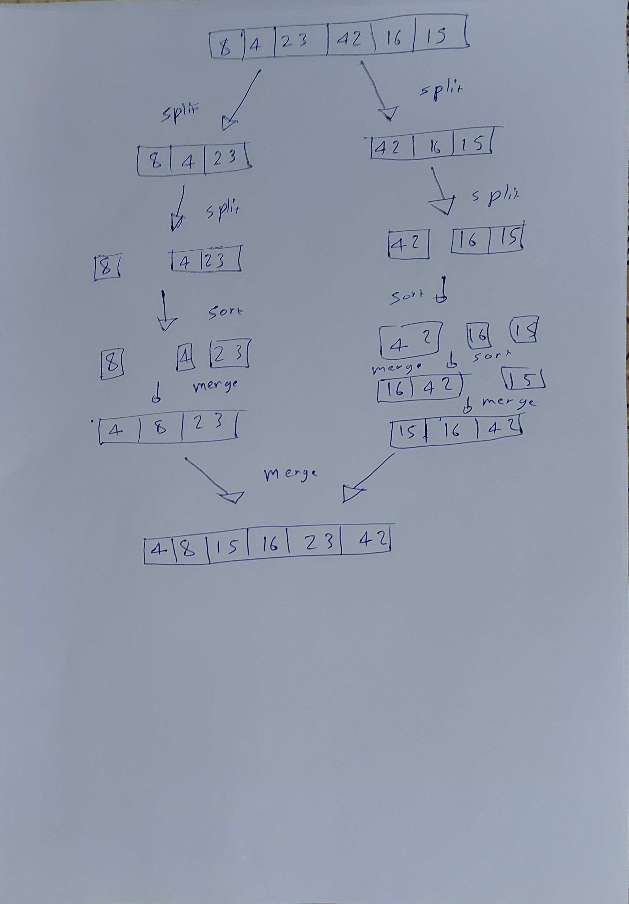

# Merge Sort

* Here we use the divide and conquer way, so we keep dividing the array until its 1 element each, then we sort it 1 by 1 and then merge them all back.

```Pseudo code

ALGORITHM Mergesort(arr)
    DECLARE n <-- arr.length
           
    if n > 1
      DECLARE mid <-- n/2
      DECLARE left <-- arr[0...mid]
      DECLARE right <-- arr[mid...n]
      // sort the left side
      Mergesort(left)
      // sort the right side
      Mergesort(right)
      // merge the sorted left and right sides together
      Merge(left, right, arr)

ALGORITHM Merge(left, right, arr)
    DECLARE i <-- 0
    DECLARE j <-- 0
    DECLARE k <-- 0

    while i < left.length && j < right.length
        if left[i] <= right[j]
            arr[k] <-- left[i]
            i <-- i + 1
        else
            arr[k] <-- right[j]
            j <-- j + 1
            
        k <-- k + 1

    if i = left.length
       set remaining entries in arr to remaining values in right
    else
       set remaining entries in arr to remaining values in left
```

* That was the pseudo code provided, here is my implemented javascript version of it

```Javascript

function mergeSort(arr){
  let n = arr.length;
  if (n>1){
    let mid = n/2;
    let left = arr.slice(0,mid);
    let right = arr.slice(mid,n);
    console.log('THIS IS LEFT '+ left)
    console.log('THIS IS RIGHT '+ right)

    mergeSort(left);
    mergeSort(right);
    merge(left,right,arr);
    return arr;
  }
}

function merge(left,right,arr){
  let i = 0;
  let j = 0;
  let k = 0;
  while(i<left.length && j<right.length){
    if(left[i] <= right[j]){
      arr[k] = left[i];
      i++;
    } else {
      arr[k] = right[j];
      j++;
    }
    k++;
  }
}
```

## Trace

Sample Array: `[8,4,23,42,16,15]`

### Pass 1

```Javascript
its split into two halves
[8,4,23] [42,16,15]
```

### Pass 1

```Javascript
its split into two halves
[8,4,23] [42,16,15]
```

### Pass 2

```Javascript
It will keep splitting
[8] [4,23] [42] [16,15]
```

### Pass 3

```Javascript
It will keep splitting
[8] [4] [23] [42] [16] [15]
```

### Pass 4

```Javascript
It will sort the halves now
[8] [4] [23] [42] [16] [15]
=> [4,8,23] [15,16,42]
```

### Pass 4

```Javascript
It will sort both of them now
[4,8,23] [15,16,42]
=> [4,8,15,16,23,42]
```

### UML



### Efficiency

* Time: O(n logn) because at it's worse, there will be a while loop and how many times the array is split.

* Space: O(n)  Because the memory allocated depends on how big the array itself is.