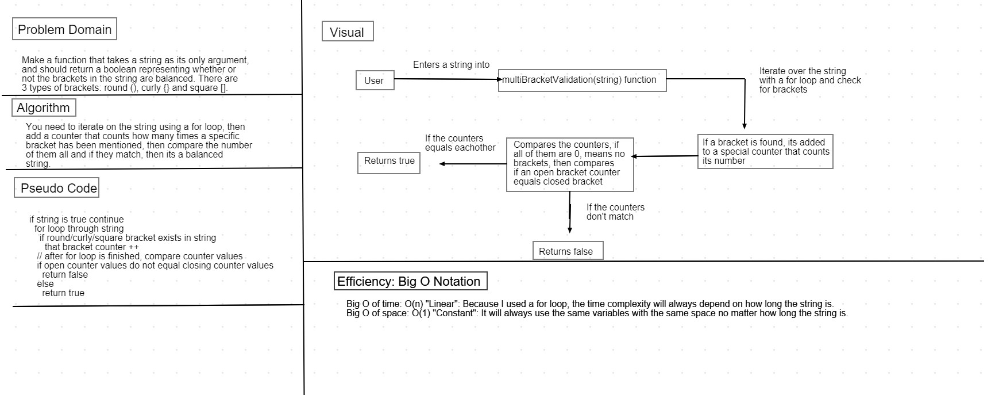

# Code Challenge 13: Multi-bracket Validation.

* Make a function that takes a string as its only argument,and should return a boolean representing whether or not the brackets in the string are balanced.

* There are 3 types of brackets: round (), curly {} and square [].

### Challenge

Your function should take a string as its only argument, and should return a boolean representing whether or not the brackets in the string are balanced. There are 3 types of brackets:

1-Round Brackets : ().

2-Square Brackets : [].

3-Curly Brackets : {}.

### Approach & Efficiency

* I iterated on the string using a for loop, then I added a counter that counts how many times a specific bracket has been mentioned, then compare the number of the specific open brackets to the closed brackets and if they match, then its a balanced string.

* Efficiency: Big O Notation

1- Big O of time: O(n) "Linear": Because I used a for loop, the time complexity will always depend on how long the string is.

2- Big O of space: O(1) "Constant": It will always use the same variables with the same space no matter how long the string is.

### API

1- `multiBracketValidation(string)`: Checks the content of the string and if it containts a balanced brackets returns true, otherwise returns false.

* Whiteboard: 
