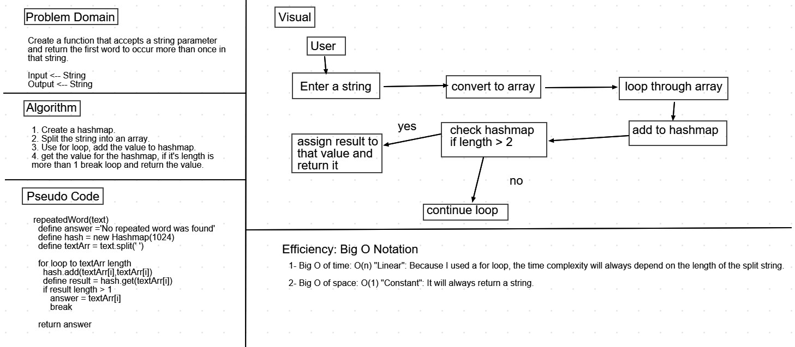

# Code Challenge 31: Repeated Word.

### Challenge

* Create a function that accepts a string parameter and return the first word to occur more than once in that string.

### Approach & Efficiency

1. Create a hashmap.
2. Split the string into an array.
3. Use for loop, add the value to hashmap.
4. get the value for the hashmap, if it's length is more than 1 break loop and return the value.

### Efficiency: Big O Notation

1- Big O of time: O(n) "Linear": Because I used a for loop, the time complexity will always depend on the length of the split string.

2- Big O of space: O(1) "Constant": It will always return a string.

### API

`repeatedWord(text)`: Takes in a string as a parameter and returns string.

* Whiteboard: 

