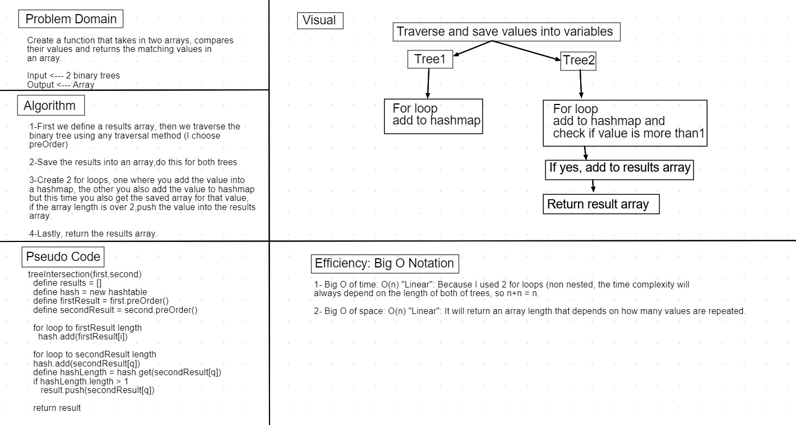

# Code Challenge 31: Tree Intersection.

### Challenge

* Create a function that takes in two arrays, compares their values and returns the matching values in an array.

### Approach & Efficiency

1. First we define a results array, then we traverse the
binary tree using any traversal method (I choose 
preOrder) 

2. Save the results into an array,do this for both trees 

3. Create 2 for loops, one where you add the value into a hashmap, the other you also add the value to hashmap but this time you also get the saved array for that value, if the array length is over 2,push the value into the results array.

4. Lastly, return the results array.

### Efficiency: Big O Notation

1- Big O of time: O(n) "Linear": Because I used 2 for loops (non nested, the time complexity will always depend on the length of both of trees, so n+n = n.

2- Big O of space: O(n) "Linear": It will return an array length that depends on how many values are repeated.

### API

` treeIntersection(firstTree, scondTree)`: Takes in two binary trees as parameters and returns an array.

* Whiteboard: 

